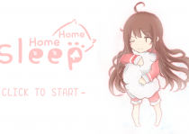
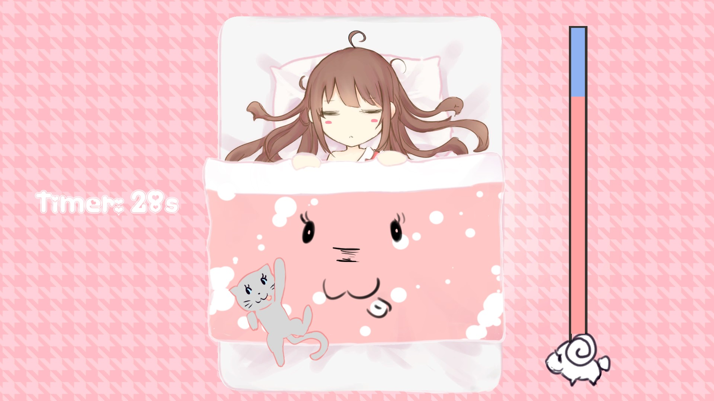
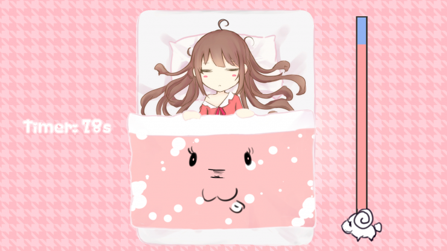
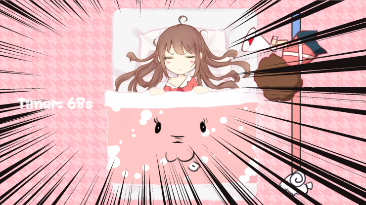

  <h1 align="center">Home Sleep Home</h1>
  
PC of an Unity Project

 

 

### Keyword
> `Unity` `Indie Game`

## Contents 
<!-- toc -->
* [Introduction](#introduction)
* [Release](#release)
* [Environment](#environment)
* [Credit](#credit)
* [Screenshots](#screenshots)
* [Contact](#contact)
* [License](#license)

<!-- toc stop -->

## Introduction

This is a GGJ HK 2019 Game Project.

Time spent on the bed at home is always not enough. And it is sadder if you wake up before you need to. Home Sleep Home is a game about trying to avoid waking up too early. Try your best to avoid premature waking.

Game Description:  
Lose: comfort value to be 0  
Win: Hold on 2 minutes and comfort value > 0  

The quilt is sliding down all the time. Press space to hold the quilt up a little bit. Ensure the quilt cover the character's body and foot to retain or recover comfort value, otherwise the comfort value would descrease. Mother would come up with a shouting, at that time, player should use their quilt to cover the ear to prevent it. A cat will show up and scratch your quilt down, player can press space more frequentily to hold the quilt. 

## Release
- [Release Page](https://github.com/tavik000/HomeSleepHome/releases/tag/v1.0.2)

## Environment
- Unity: 2018.3.2f1  
- Visual Studio: 7.6.11  

#### Quick Links
- [Global Game Jam Hk Game: Home Sleep Home](https://globalgamejam.org/2019/games/home-sleep-home)

## Credit

Zhao, Haiqi: Programming (GGJ User: tavik000) [Key](https://github.com/tavik000) 

Denis Huen: Game Design (GGJ User: denishuen)

Chen Qi: Programming (GGJ User: Peter Chen) [Chen Qi](https://github.com/Cqyhid)  

Su Gengmin: Programming  (GGJ User: Karl So) [Karl So](https://github.com/KarlSoHelloworld)  

SIT, Man Kong: Game Design, SFX, Video Editor (GGJ User: sitmankong)

Nathan Hui : Game Design (GGJ User: nathanhui)

Ho Wai Lok: Art & Game Design (GGJ User: goldenbird)

## Screenshots

Gameplay  
  
  
  
  

Gameplay Video:  

**If you like this, please leave a star.**

-----

## Contact

Email:  Key <tavik002@gmail.com>

-----
## License
MIT License

Copyright (c) 2019 key

Permission is hereby granted, free of charge, to any person obtaining a copy
of this software and associated documentation files (the "Software"), to deal
in the Software without restriction, including without limitation the rights
to use, copy, modify, merge, publish, distribute, sublicense, and/or sell
copies of the Software, and to permit persons to whom the Software is
furnished to do so, subject to the following conditions:

The above copyright notice and this permission notice shall be included in all
copies or substantial portions of the Software.

THE SOFTWARE IS PROVIDED "AS IS", WITHOUT WARRANTY OF ANY KIND, EXPRESS OR
IMPLIED, INCLUDING BUT NOT LIMITED TO THE WARRANTIES OF MERCHANTABILITY,
FITNESS FOR A PARTICULAR PURPOSE AND NONINFRINGEMENT. IN NO EVENT SHALL THE
AUTHORS OR COPYRIGHT HOLDERS BE LIABLE FOR ANY CLAIM, DAMAGES OR OTHER
LIABILITY, WHETHER IN AN ACTION OF CONTRACT, TORT OR OTHERWISE, ARISING FROM,
OUT OF OR IN CONNECTION WITH THE SOFTWARE OR THE USE OR OTHER DEALINGS IN THE
SOFTWARE.

[⬆ Back to top](#contents)

**All Copyright Reserved**
